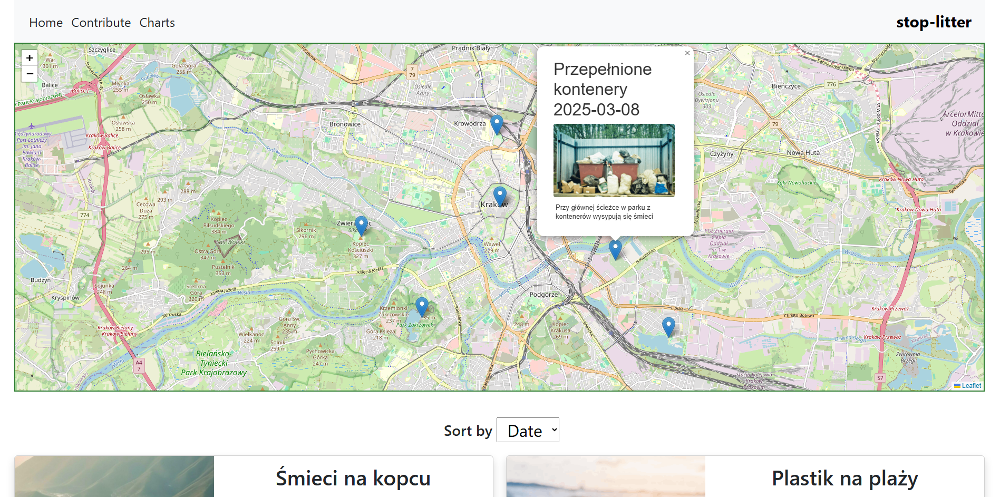

# stop-litter

**stop-litter** is an interactive platform designed to streamline the reporting and monitoring of environmental littering. Users can easily submit reports by selecting a location on the map, providing details, and attaching a photo. The data is then visualized on both a map and charts, enabling NGOs and volunteers to quickly respond and plan clean-up actions.

## Contributors:
- **[Filip Węgrzyn](https://github.com/wegorz13)**
- **[Natalia Czajak](https://github.com/nczajak)**
- **[Seweryn Tasior](https://github.com/Sewery)**
- **[Filip Mokrzycki](https://github.com/Filipmok-agh)**

## Technologies Used
- **Frontend**: React, TypeScript, Bootstrap  
- **Mapping**: Leaflet  
- **Backend**: Express  
- **Database**: SQLite  
- **Charts**: Chart.js  

---

## Features

### 1. Navigation Bar
- Allows smooth navigation across the application.  
- Links to essential sections such as the home page, contribute and charts

### 2. Map of Reports
- Leaflet map with all reported locations marked.  
- Clicking a pin opens a popup with the report’s title, description, photo, and date.

### 3. Report Submission
- Form collects all key information:  
  - **Title** of the incident  
  - **Description**  
  - **Date**
  - **Photo**  
  - **Location**, automatically fetched from the user’s device  

### 4. Home page
- On the Home page, reports can be sorted by:  
  - Date  
  - Number of “bumps” (votes for report importance)  
- Users can click a “bump” to increase a report’s priority.

### 5. Charts and Statistics
- Interactive charts display report data.  
- Helps analyze trends over time and hotspots by location.

### 6. Responsiveness
- Fully responsive design for desktops, tablets, and smartphones.  

  
  

